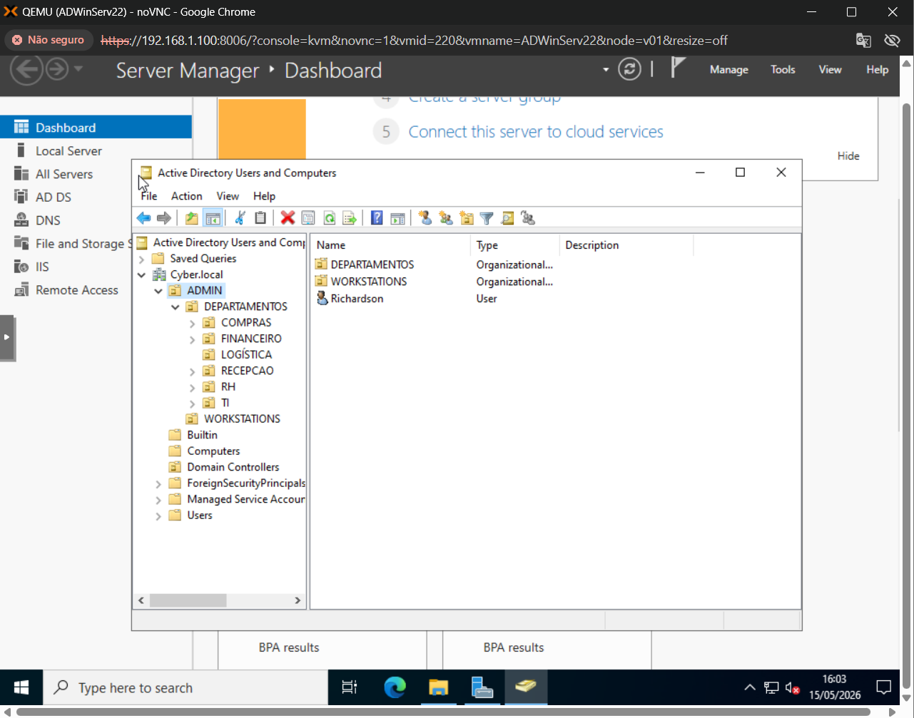
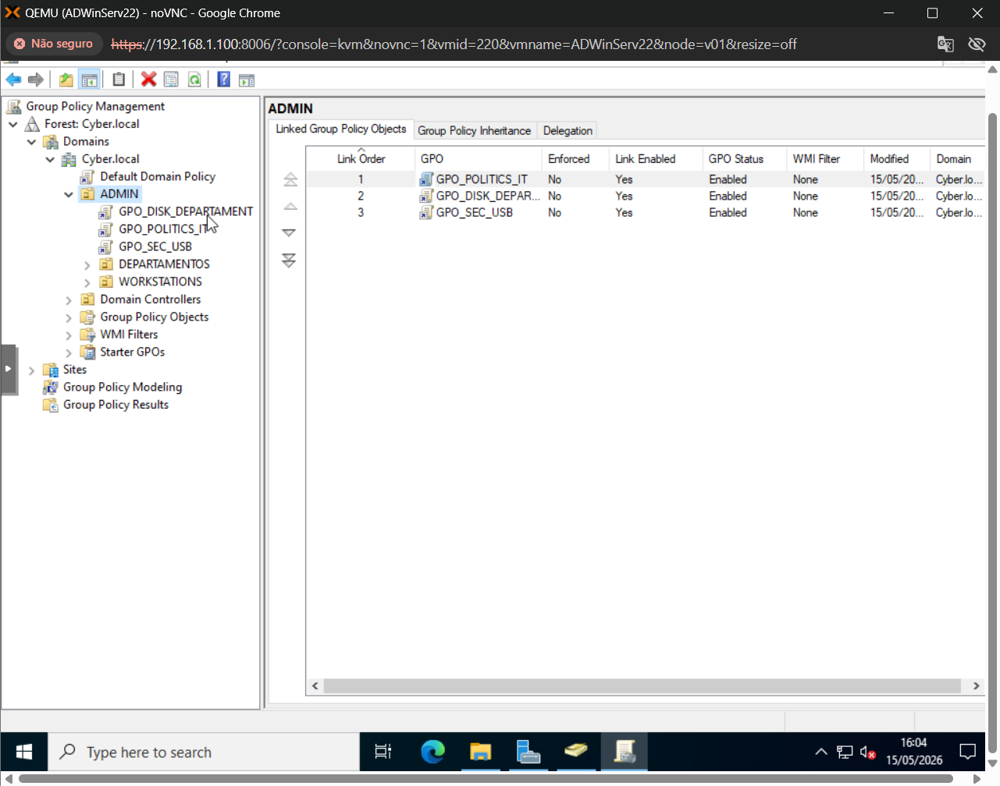
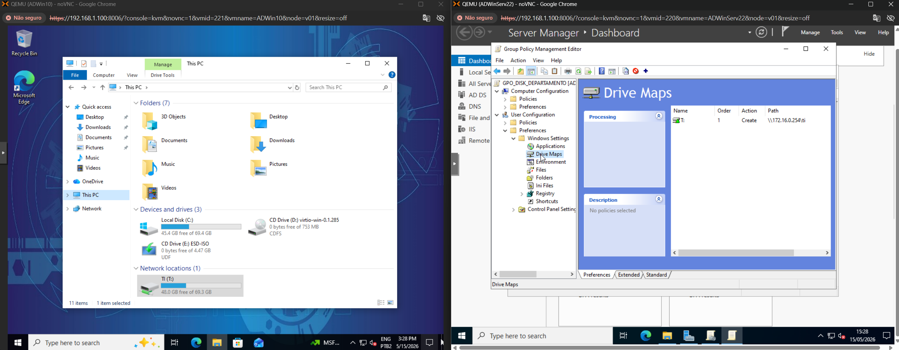
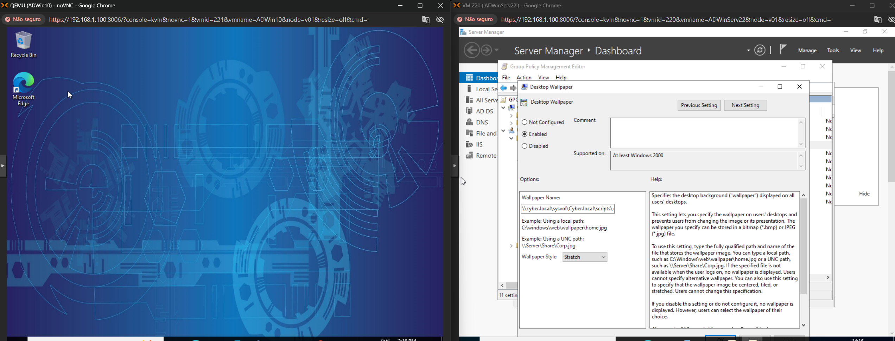
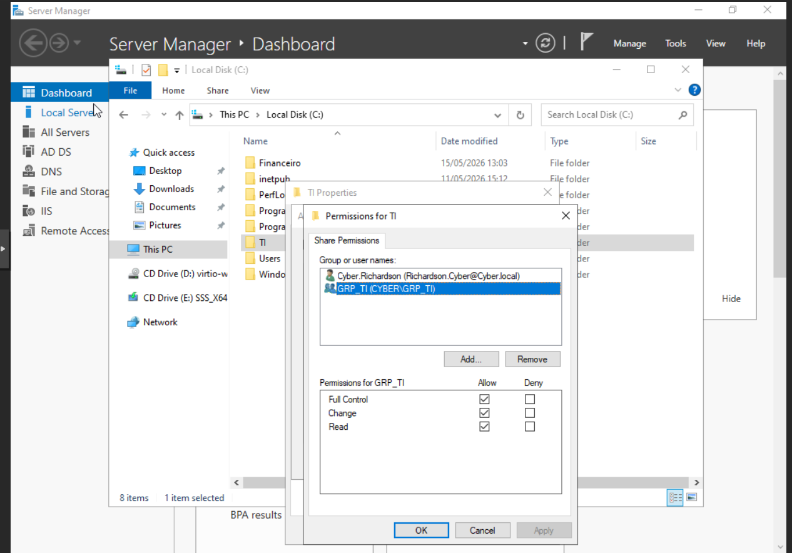

# active-directory-lab
Laboratório Active Directory simulando ambiente corporativo utilizando Windows Server pelo Proxmox.

Projeto desenvolvido para simular um ambiente corporativo utilizando Windows Server e Active Directory, aplicando boas práticas de administração de usuários, políticas de grupo, compartilhamentos de arquivos e controle de acesso.

---

# Objetivos

- Implementar uma estrutura organizacional utilizando Active Directory.
- Criar e organizar usuários por departamento.
- Aplicar Group Policies (GPO).
- Configurar compartilhamentos de rede.
- Mapear unidades automaticamente para os usuários.
- Simular um ambiente corporativo real.

---

# Ambiente Utilizado

- Windows Server 2022
- Active Directory Domain Services (AD DS)
- DNS
- Group Policy Management
- File Server
- NTFS Permissions
- Proxmox VE

---

# Estrutura Organizacional

Foram criadas Organizational Units (OUs) para separar os departamentos da empresa.

## Departamentos

- Compras
- Financeiro
- Logística
- Recepção
- Recursos Humanos (RH)
- Tecnologia da Informação (TI)

---

# Gerenciamento de Políticas (GPO)

Foram implementadas políticas para automatizar configurações e aumentar a segurança do ambiente.

## GPOs Criadas

- GPO_DISK_DEPARTAMENT
- GPO_POLITICS_IT
- GPO_SEC_USB

### Funcionalidades

- Mapeamento automático de unidades de rede
- Restrição de dispositivos USB
- Padronização do ambiente
- Configurações centralizadas

---

# Mapeamento Automático de Unidade

Foi configurado o mapeamento automático da unidade de rede através de Group Policy Preferences.

---

# Personalização do Ambiente

Aplicação de papel de parede corporativo para os usuários através de Group Policy.

.

---

# Compartilhamento de Arquivos

Implementação de servidor de arquivos com permissões controladas por grupos e departamentos.

## Recursos Aplicados

- Compartilhamentos de rede
- Permissões NTFS
- Controle de acesso por setor
- Gerenciamento de grupos

.

---

# Conhecimentos Praticados

- Active Directory
- Administração Windows Server
- DNS
- Organização de OUs
- Gerenciamento de usuários e grupos
- Group Policy Objects (GPO)
- Compartilhamentos de rede
- NTFS Permissions
- Troubleshooting de infraestrutura Microsoft

---

# Autor

**Richardson Wandermurem**

- LinkedIn: https://www.linkedin.com/in/richardsonwandermurem/
